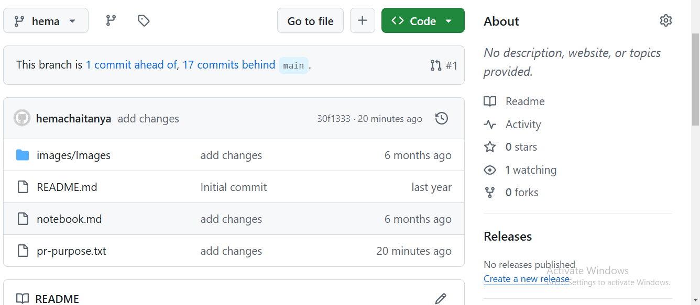
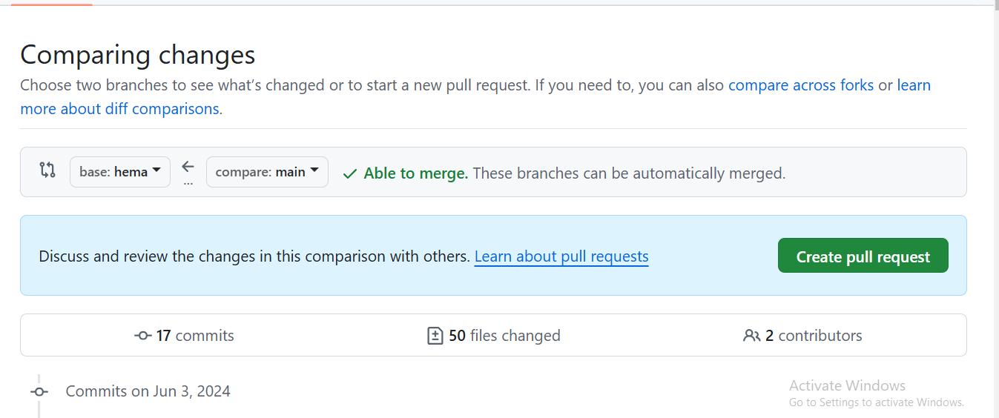
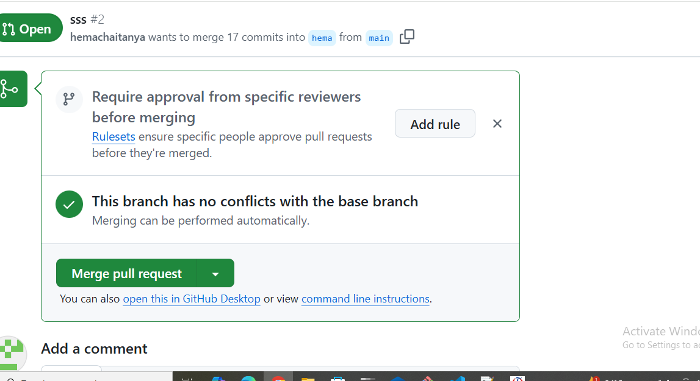

## rise pr

* we already have one branch in git repo .

* we clone that git repo 

* we create one new branch and take some changes in that branch  like add any text in repo 

* git add file-name

* git commit -m "add changes"

* git push origin new-branchname

* go to the git repo 

* create pull request 

* check the changes

* merge the changes